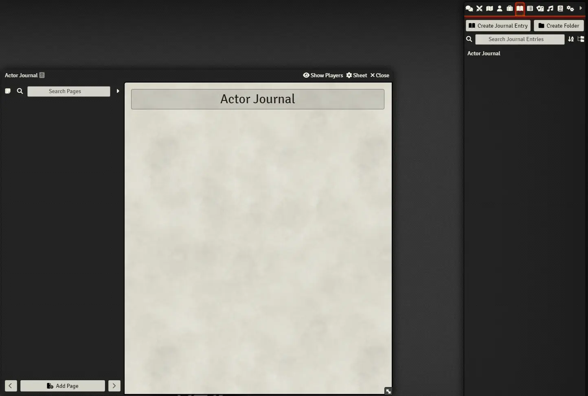
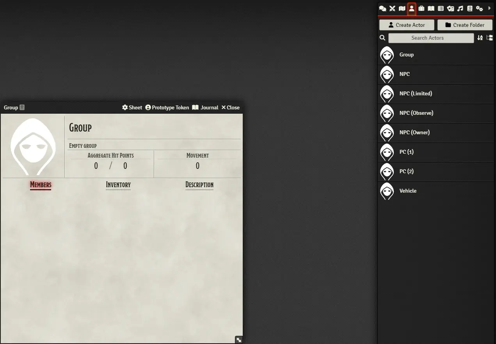
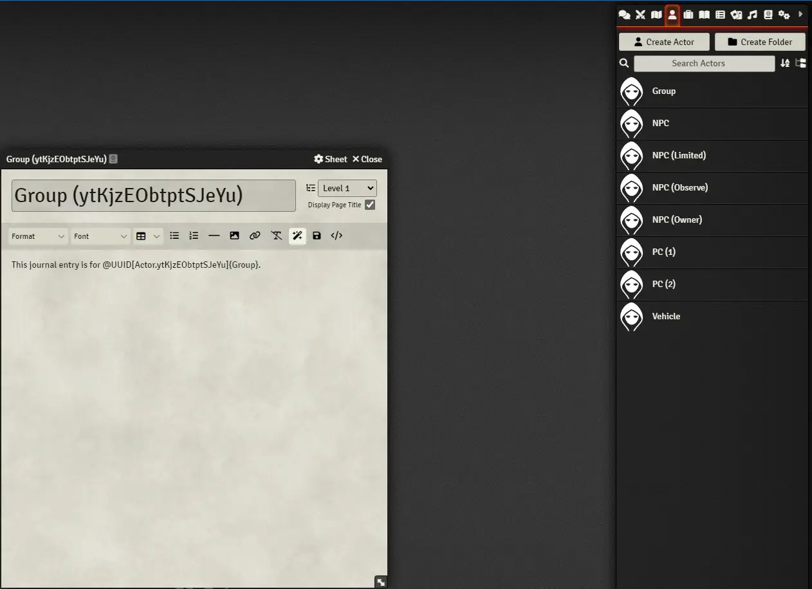
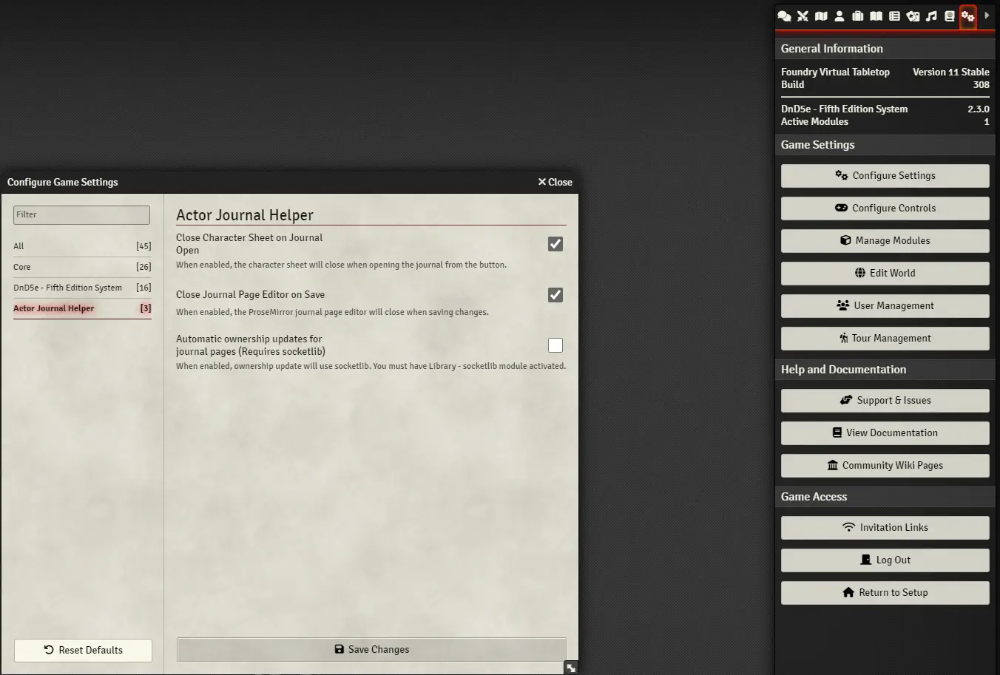

# Actor Journal Helper

**Version**: 1.0.0  
**System Compatibility**: D&D 5e - Fifth Edition System v2.3.0  
**Foundry VTT Compatibility**: Version 0.11.x

Enhance your Foundry VTT experience with the Actor Journal Helper module. Designed for the D&D 5th Edition System, this module streamlines the process of creating and managing journal pages for each actor, providing a convenient link directly in the character sheet header and automatically generating a link back to the character sheet in the journal.

The module is designed to provide a balance of features, streamlining compartmentalized note taking by pulling the journal up in edit mode and limiting access to journal pages based on their ownership relationship with the associated actor, while consolidating actor journal in one place for easy access and facilitation of a collaborative note taking experience.

I created this module because I like to give my players limited or higher ownership of actors that they have met (being careful of what I leave in the biography section though). This allows my player to see these actors in the actor tab. The have access to the actor's name, character art, biography, and, depending on ownership, maybe more. I want my players to be able get more use out of this and provide them with an easy way to keep compartmentalized and/or collaborative notes relating to these actors.

## Important notes

- Don't removed the parentheses or their contents from the journal pages' names. These are the actor IDs, which are used by the journal button on the character sheets to bring up the correct journal. It just looks for the parentheses and the ID within, so you can modify the rest of the journal page name.
- If the user has limited or higher ownership of an actor, they will be able to create and/or edit the journal associated with that actor via the character sheet.
- The default ownership for the Actor Journal is "owner", however, each page is set to "none" by default, granting each user ownership individually only after they have accessed the editor through the character sheet or after the GM gives them ownership manually.

## Features

- **Quick Access Button**: Adds a button to the header of an actor's character sheet for instant access to their associated journal page.
- **Two-Way Linking**: Automatically generates a journal page for the actor and establishes a link on the page back to the character sheet.
- **User-Friendly**: Users with at least limited ownership of the actor can navigate seamlessly between character sheets and journal pages.
- **Automatic Ownership Updates**: Ownership of journal pages can be automatically updated, enhancing collaboration among players and GMs.
- **Socketlib Integration**: If the optional socketlib module is activated, ownership updates are executed smoothly via socket communication.

## Installation

1. In Foundry VTT, navigate to the "Add-On Modules" tab in the Configuration and Setup menu.
2. Click the "Install Module" button.
3. Paste the following URL into the "Manifest URL" field: `https://raw.githubusercontent.com/puddleimages/actor-journal-helper/main/module.json`
4. Click "Install" and wait for Foundry VTT to automatically install the module.

## Usage

1. Open an actor's character sheet.
2. Look for the newly added button labeled "Journal" in the sheet's header.
3. Click the button to generate the associated journal page or navigate to it if it already exists.
4. Enjoy the simplified navigation between character sheets and their corresponding journal pages.
5. Collaborate Effortlessly: With automatic ownership updates, maintaining control over journal pages is now hassle-free.

## Settings

- **Close Character Sheet on Journal Open**: Optionally close the actor's character sheet when opening the associated journal page (enabled by default).
- **Close Journal Page Editor on Save**: Optionally close the ProseMirror journal page editor when saving changes (enabled by default).
- **Automatic Ownership Updates**: Enable or disable automatic ownership updates for journal pages (disabled by default because it requires socketlib).

## Screenshots

## Feedback and Support

If you encounter any issues or have suggestions for improvements, please [open an issue](https://github.com/puddleimages/actor-journal-helper/issues) on GitHub.

---

**Note**: This module is designed for Foundry VTT v0.11.x and the D&D 5e - Fifth Edition System v2.3.0.

**Author**: puddleimages

**GitHub Repository**: [Actor Journal Helper](https://github.com/puddleimages/actor-journal-helper)
